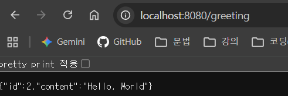
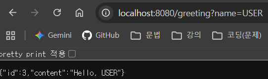

# Spring Guides: Building a RESTful Web Service

---
## 1. 무엇을 만드는 Guide 인가?
* **개념**: HTTP GET 요청을 받아 JSON 형태의 인사말 응답을 제공하는 RESTful 웹 서비스 구축
* **주요 기능**:
    * `/greeting` 경로로 요청 시 기본 인사말(`Hello, World!`) 반환
    * URL 쿼리 파라미터(`?name=Value`)를 전달받아 동적으로 인사말 대상(`Hello, Value!`) 변경
    * 요청이 들어올 때마다 고유한 `id` 값을 1씩 자동 증가시켜 응답(AtomicLong 사용)

---

## 2. 새롭게 배운 Spring & Java 기술

### 1) Java Record (Resource Representation Class)
* **불변 데이터 객체(DTO)** 작성 키워드
* `private final` 필드, 생성자, getter(`id()`, `content()`), `equals()`, `hashCode()`, `toString()`을 컴파일 시 자동 생성
  &rarr; 보일러플레이트 코드를 최소화

### 2) Jackson JSON 라이브러리 (Marshalling)
* Spring Web Starter에 기본 포함된 라이브러리
* 컨트롤러가 자바 객체를 반환 &rarr; `MappingJackson2HttpMessageConverter`가 이를 자동으로 **JSON 형태 데이터로 직렬화(Serialization)**하여 응답 본문에 작성

### 3) 기존 MVC vs RESTful Controller 차이
* **기존 MVC**: Server-Side Rendering(SSR) 방식으로 HTML 뷰(View)를 반환
* **RESTful Controller**: `@ResponseBody`가 적용되어 HTML 화면 대신 **순수 데이터(JSON)**를 응답 본문에 직접 기록

### 4) `AtomicLong`과 동시성(Concurrency) 관리
* **개념**: 멀티스레드 환경에서 Synchronized 락(Lock) 없이 원자성(Atomicity)을 보장하며 `long` 값을 변경하는 클래스
* **작동 원리**: CPU 레벨의 CAS(Compare-And-Swap) 알고리즘을 사용해 0.000001초 차이로 여러 요청이 동시 진입하더라도 ID 중복이나 씹힘 현상이 발생하지 않음
* **`counter.incrementAndGet()`**: 값을 안전하게 1 증가시킨 뒤 증가된 값을 즉시 반환함 (`++counter`의 스레드 안전 버전).

### 5) 스프링 빈(Spring Bean)과 싱글톤 패턴
* **스프링 빈**: 스프링 컨테이너가 직접 생명주기(생성~소멸)를 관리하는 자바 객체.
* **동작 방식**: `@RestController`로 선언된 컨트롤러는 서버 구동 시 단 **하나의 인스턴스만 생성되어 재사용(싱글톤 패턴)**됨
* 따라서 개별 사용자나 브라우저 상태와 상관없이 **전체 클라이언트의 요청이 단 하나의 `counter`를 공유하여 ID가 누적 증가**함.

### 6) Gradle 실행 및 빌드 방식의 차이
* **`./gradlew bootRun`**: 소스 코드를 별도 패키징 없이 로컬 개발 환경에서 즉시 실행 (개발 및 테스트용).
* **`./gradlew build`**: 컴파일 후 실행 가능한 단일 `.jar` 파일을 생성 (운영 환경 배포용).

 

### 추가) Git 환경 및 브랜치 관리
* **CRLF/LF 경고**: Windows(`CRLF`)와 Linux/Mac(`LF`) 간 줄바꿈 문자 차이에 따른 Git 단순 경고 메시지.
---

## 3. 핵심 Annotation 설명

| Annotation | 설명                                                                                 |
| :--- |:-----------------------------------------------------------------------------------|
| **`@SpringBootApplication`** | `@Configuration` , `@EnableAutoConfiguration` , `@ComponentScan` 기능을 합친 편의성 어노테이션. |
| **`@RestController`** | `@Controller` + `@ResponseBody` 축약형. 메서드 반환값을 HTML 뷰가 아닌 JSON 응답 본문으로 다룸.          |
| **`@GetMapping("경로")`** | 특정 URL의 HTTP GET 요청을 메서드에 매핑 (`@RequestMapping(method=GET)`의 단축 표현).               |
| **`@RequestParam`** | HTTP 쿼리 파라미터를 메서드 변수에 바인딩. `defaultValue`로 필수값 누락 시 기본값 지정 가능.                     |

---
## 4. 실행 화면 캡처

### 1) 기본 요청 (`/greeting`)
* **URL**: `http://localhost:8080/greeting`
* **설명**: `name` 파라미터 미전달 시 기본값(`World`)으로 응답
  

### 2) 파라미터 전달 요청 (`/greeting?name=User`)
* **URL**: `http://localhost:8080/greeting?name=User`
* **설명**: 쿼리 파라미터가 정상 반영되어 `Hello, User!`가 출력되며, 동일 인스턴스 카운터에 의해 `id`가 1 증가
   

---

